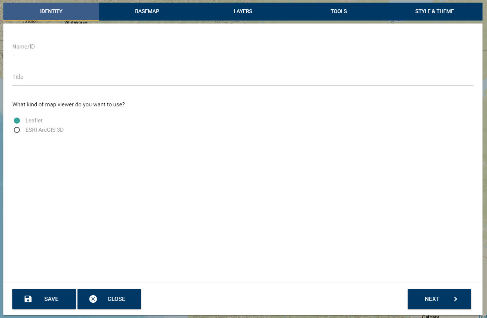
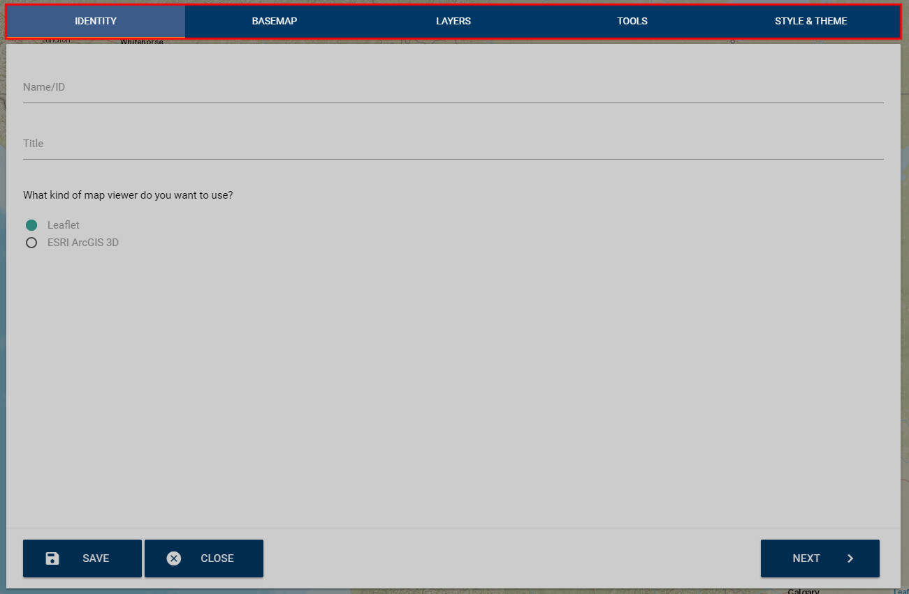
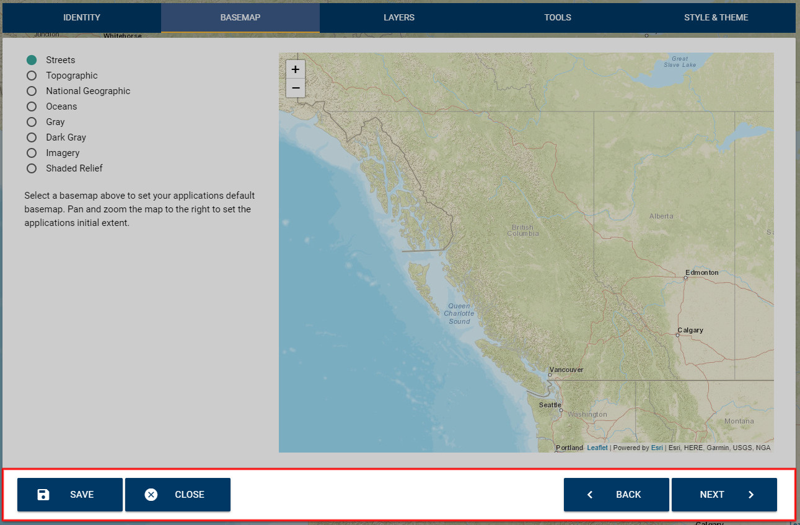

# SMK Admin UI User Guide - Configuration Editor
[Back to ToC](SMK-Admin-UI-User-Guide)

When you click "Create" or "Edit" from the welcome screen, you'll be presented with the Map Configuration editor. The Map Configuration editor allows you to make many modifications to your configuration, including updating the name and ID, adding or removing layers, and changing tool behaviour.
***
## The Editor Screen Tabs
The editor screen, after clicking "Create":

The screen is made up of a number of different tabs which contain the configuration options:

The configuration tabs are:
* **Identity:** Modify the Name, ID, and Viewer type
* **Basemap:** Set the default base map and extent of a site when it is accessed
* **Layers:** Add, remove, and edit layers and layer queries
* **Tools:** Add, remove, and edit tool configurations
* **Style & Theme:** Alter the applications styling, header image

For more information, click the links below

1. [Identity](SMK-Admin-UI-User-Guide:-Identity-Tab)
2. [Basemap](SMK-Admin-UI-User-Guide:-Basemap-Tab)
3. [Layers](SMK-Admin-UI-User-Guide:-Layers-Tab)
4. [Tools](SMK-Admin-UI-User-Guide:-Tools-Tab)
5. [Style](SMK-Admin-UI-User-Guide:-Styles-and-Themes-Tab)

## The button bar
At the bottom of the editor, there is a button bar that contains basic controls:

Available buttons are:
* Save
* Close
* Back (if necessary)
* Next (If necessary)
* If you are editing a layer, a "Done Edits" button may also be present over the Back/Next buttons

### Save
Clicking once on the Save button will attempt to compile your Map Configuration json, and persist it to the database. If there are any errors or failures, you will be returned to the editor screen where you can correct any errors and attempt to save again. Note that when you click Save your json configuration will be available in your browsers logging console, if you wish to review or extract it from there.
### Close
Clicking Close will cancel your edits and return to the Welcome screen. No changes will be retained.
### Back/Next
Clicking on the Back or Next buttons will navigate through the tabs in a sequential order. Optionally, you can click any of the tab headers at the top at any time to navigate to a desired configuration screen.
### Done Edits
The "Done Edits" button displays when you are actively editing a layer in the Layers configuration tab. When you have finished making your desired changes to the layer, click once on "Done Edits" to close the layer editor and return to the Layer Configuration tab.

