# SMK Admin UI User Guide - Layers Tab

The layers tab is where you'll be able to add and modify layers for your site, as well as add and modify layer queries.

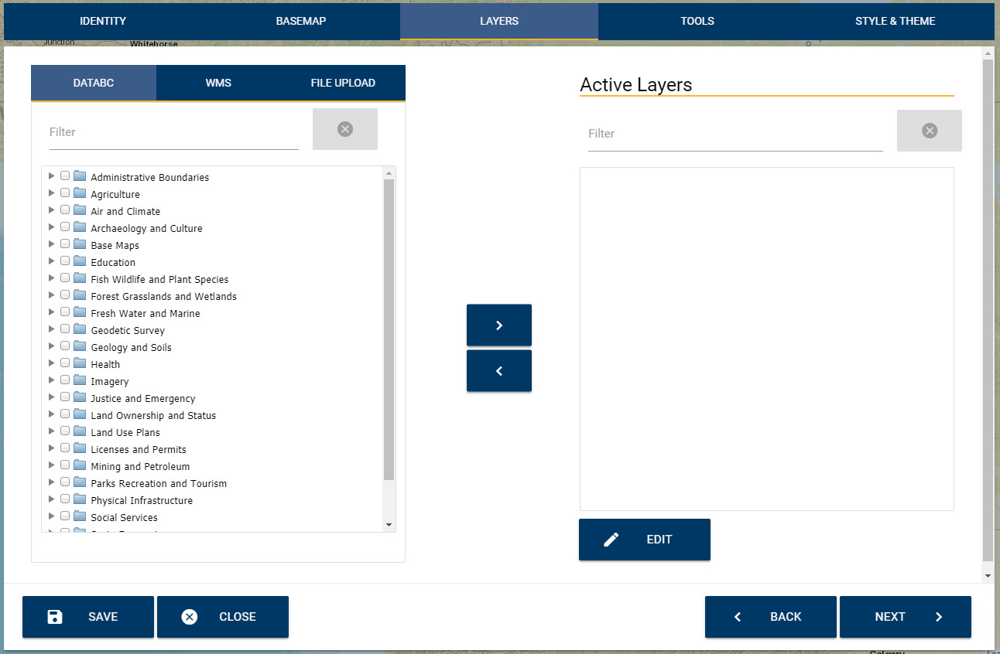

You can add layers from three different source types

* DataBC's Layer Catalog (ArcGIS Dynamic Layers)
* WMS Service
* Vector layer file (KML, KMZ, GeoJSON, Shapefile)

Layer creation options are found on the left of the Layers tab. Your configurations active layers are found on the right.

## Adding a DataBC Catalog Layer
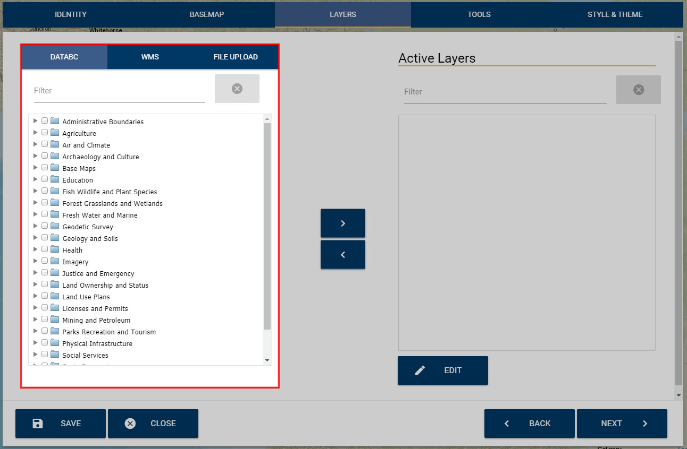

When you launch the configuration editor, the DataBC Layer Catalog will automatically be queried and the list box populated with available public layers in the layer catalog. Currently the Admin UI configuration editor can only be used with public layers, but it is possible to add any secure layers to your configuration manually (be aware you will need to ensure siteminder login for IDIR credentials when you host your site, or secure layers will not function, even if added manually)

The list view contains an identical folder structure to other catalog tools that utilize MPCM, so the structure and naming should be familiar for users of IMF2 or DMF.

The Layer Catalog contains a large number of layers (increasing daily!), so to assist with locating a desired layer, a search filter function is available above the list.

### How to find and add layers with from the Catalog
First, it's recommended to use a filter. There are a lot of layers and searching manually will be painful. To use the filter, type the name (or a keyword) for the desired layer in the filter text box.

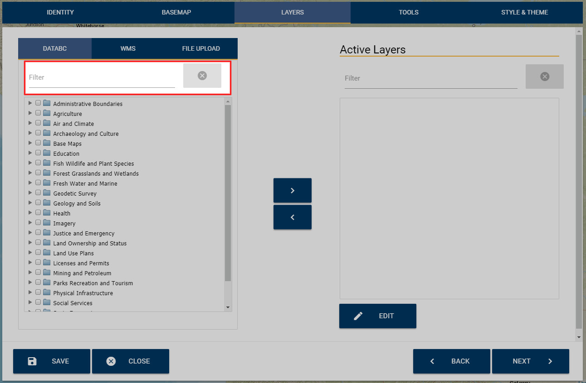

As you type, a filter will be automatically executed, and your list view will begin to remove any layers/folders that do not contain a matching text string. If you need to clear the filter, click the clear button beside the filter text box.

Once you've located your layer, click once on the check box beside the layer name. Ensure the check box is highlighted.

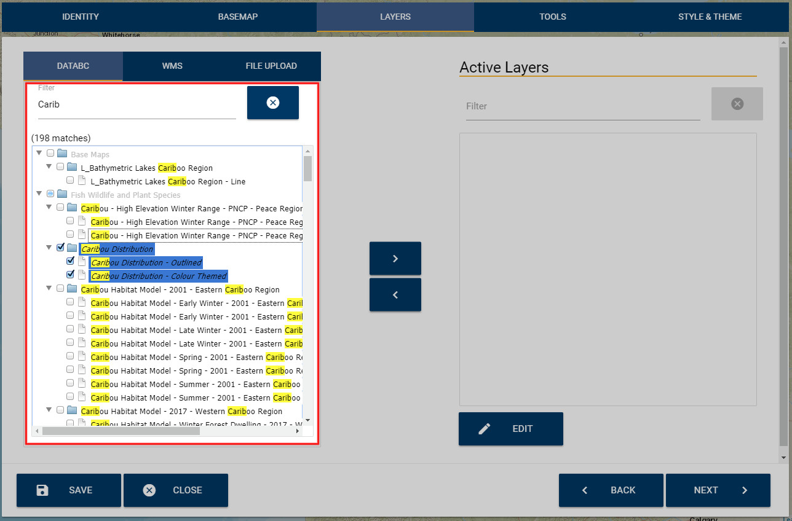

Note that you can select multiple layers at once, or select whole folders if desired (If you do that, be aware it may take a minute to create the config information, so be patient while it loads).

Once you've selected your layers and you're ready to add them to your configuration, click the add arrow to the right of the layer selection list.

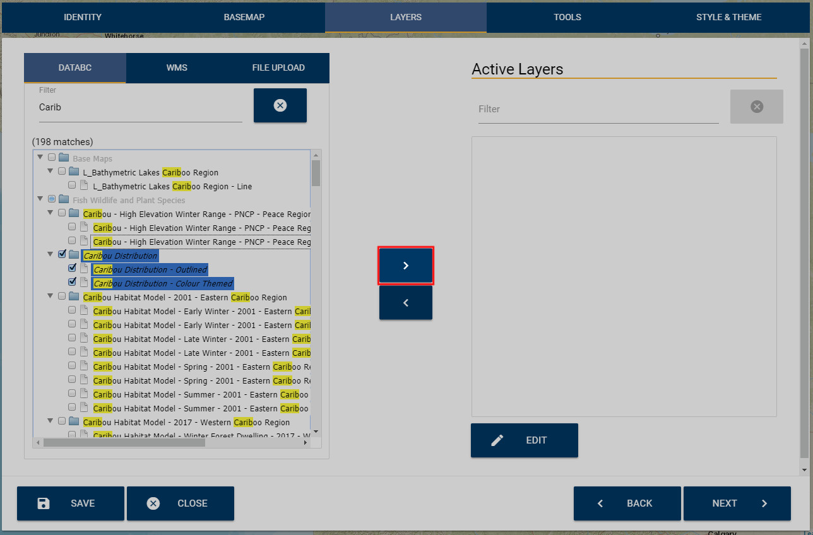
(It's probably obvious, but the button below will remove a layer from the Active Layers List)

Your layer will be added to your application.

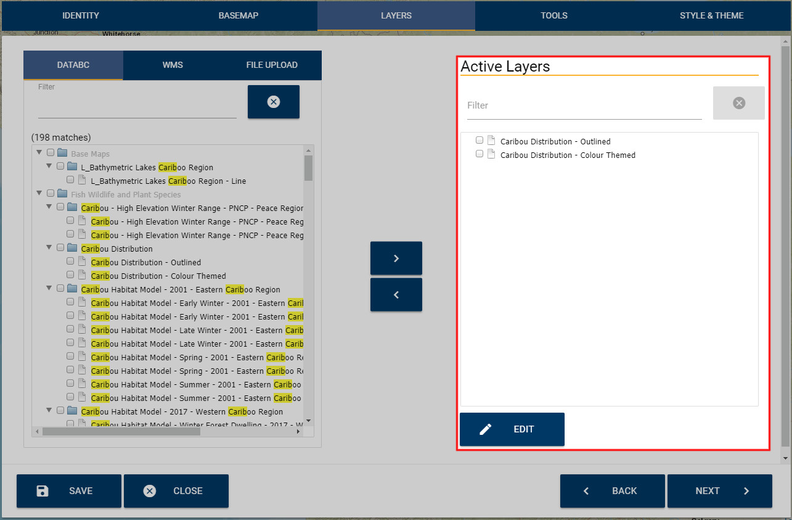

## Adding a WMS Layer
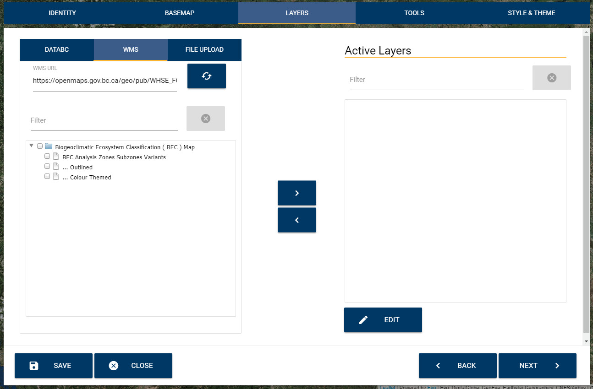

Adding WMS Layers works in the same way as adding DataBC layers, except you must provide a source for the WMS service first. The DataBC WMS catalog is added by default, but this service is extremely large and it's highly recommended that you provide a direct link to a catalog layer instead. For example, to access the BEC layers in the DataBC WMS Catalog, you can provide a URL like this: https://openmaps.gov.bc.ca/geo/pub/WHSE_FOREST_VEGETATION.BEC_BIOGEOCLIMATIC_POLY/ows

Note: The Admin UI automatically includes the service and request type for GetCapabilities. You do not need to include this info.

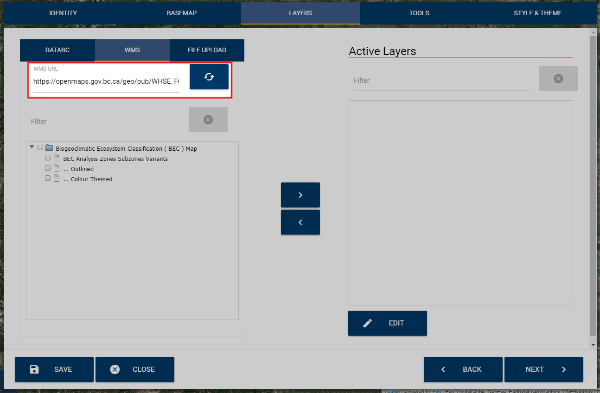

Once you have supplied a URL to a WMS service, click the "load" button to the right of the URL textbox, and available layers will be listed in a list box below. This list box behaves exactly the same as the DataBC Catalog box, and includes a filter for larger services.

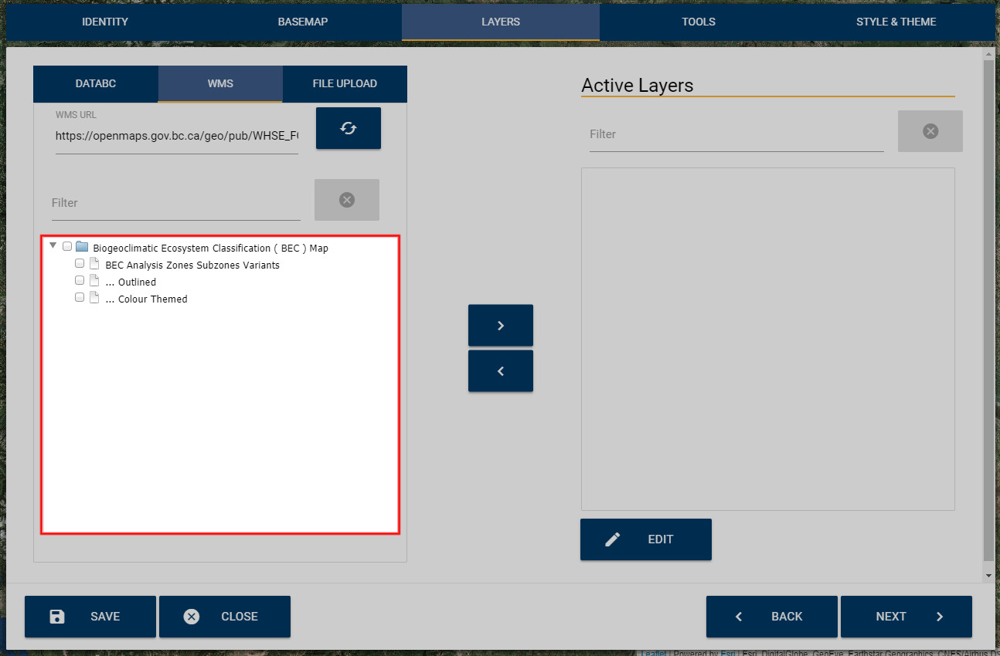

## Adding a Vector Layer
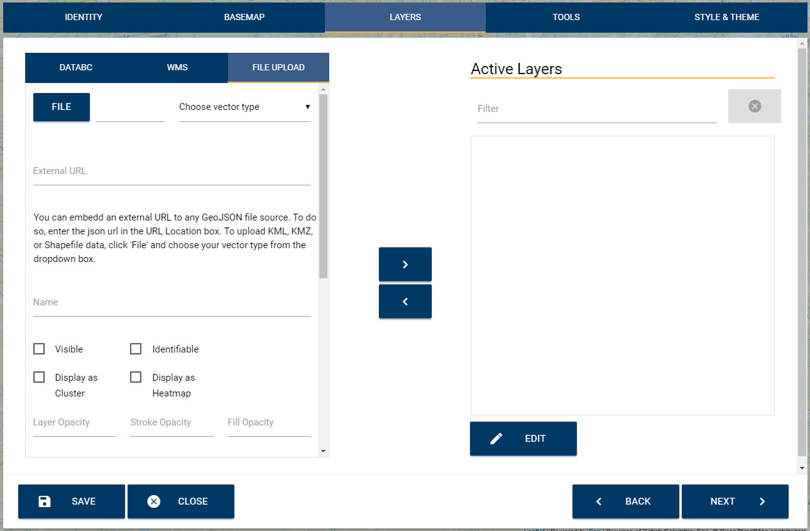

SMK supports vector data in GeoJSON format. All vector data you add will be converted into GeoJSON. Currently SMK supports converting the following formats to GeoJSON:

* KML
* KMZ
* Shapefile (in a zip)

SMK only supports data WGS84 in Lat/Long, so ensure your data is always in that format. The translator will not attempt to reproject KML, KMZ, or GeoJSON. Projection is available for Shapefiles in most cases.

### KML / KMZ
KML and KMZ translation uses the latest 2.2 version of the [KML specification](https://developers.google.com/kml/documentation/kmlreference), including [ExtendedData](https://developers.google.com/kml/documentation/kmlreference#extendeddata). Not all ExtendedData formats are handled. SMK only supports simple formatting currently:

```
    <ExtendedData>
        <Data name="someAttribute">
            <displayName>Some Attribute</displayName>
            <value>123 Attribute!</value>
        </Data>
    </ExtendedData>
```

The translation will attempt to create styles for your layer that match styling that exists in the KML, including downloading and attaching any marker symbols included. Note that to support SMKs choice of map viewers, layers are expected to only contain a single data type, so KML/KMZ files with mixed spatial content may not load styling correctly.

KML/KMZ placemarks often contain a "Description" attribute. If a description is included, it will be used in the translated GeoJSON for display in identify popups. If you do not include a description, but do have ExtendedData attributes, these will be displayed instead. If you do not wish to use Description popups, exclude them from your KML file.

### Shapefile
SMK supports importing shapefiles. A shapefile must be submitted in a Zip file, with the shapefile at the root of the zip (no folders). If you do not include a projection file, it will be assumed that your shapefile is in WGS84, and no projection will occur. If you include a db file, the generated GeoJSON will include all attribute data in the json properties.

### Vector Upload Options
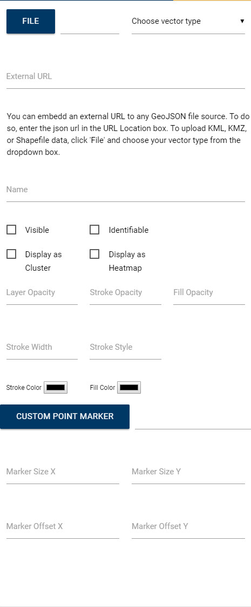

All vector formats have the same options. Some options are only relevant if you have polygon, line or point data, and can be ignored.

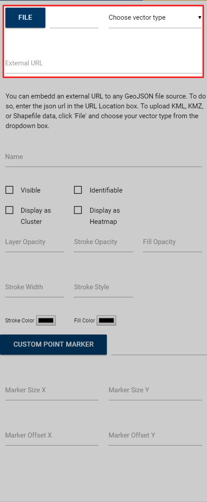

The first block of options involves the location of your vector file. If you have a GeoJSON file, you can import it, or you can link to it externally. For KML, KMZ and shapefiles, you must upload the file.

### Upload a File
Use the "File" button to select your file. The "Choose Vector Type" dropdown lets you specify the type of file you're uploading. SMK will attempt to use content types to figure out what type of file you submit so it isn't necessary, but using the dropdown ensures your file will be translated by the correct process.

### Embed an external GeoJSON URL
You can embedd an external URL to any GeoJSON file source (but no other vector type). To do so, enter the url where your GeoJSON exists in the URL Location box. This can be any accessible external location, including a rest service endpoint (FME process endpoints work great).

Once you've got a source file in place, you can specify the naming and rendering options.

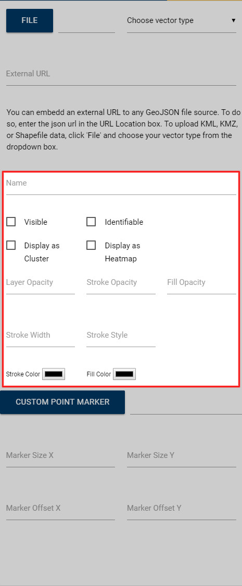

### Name
Enter the name you want for your layer in the "Name" text box. Any string is acceptable, but because this name is used for ID's to linked attachments (source json, markers, etc) special characters are not supported. Alpha-Numeric only.

### Visible
the "Visible" checkbox determines if the layer will be shown when your application is started. If it is checked off, the layer will remain hidden until the user turns it on manually.

### Identifiable
The "Identifiable" checkbox determines if the layer accepts interaction with the identify tool. If this is checked, when you click on a feature the identify tool will attempt to return attribute results. If you don't want to identify the feature (for example, if it doesn't have attributes) leave this unchecked.

### Display as Cluster
The "Display as Cluster" checkbox determines if any available point data will be clustered. For high-density point datasets, we highly recommend that you enable clustering, as it greatly enhances performance. Note that clustering can cause some initial lag during loading as the clusters are calculated. If you have an extremely large volume of points, consider splitting the data, if possible, to speed up loading times.

### Display as Heatmap
The "Display as Heatmap" checkbox determines if any available point data will generate a heatmap layer. Heatmap layers are not interactable, but show a visual representation of feature density.

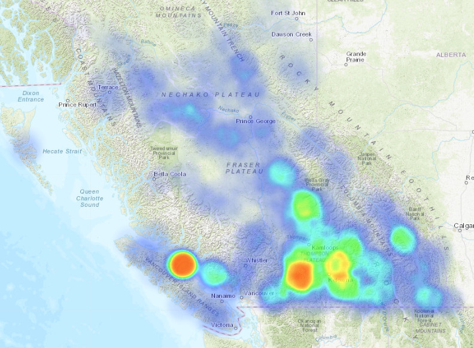

### Layer Opacity
The "Layer Opacity" textbox accepts decimal values representing the opacity of the whole layer. Acceptable values are 0.0 to 1.0, where 0.0 is totally transparent, and 1.0 is completely visible. Any number higher than 1.0 will be defaulted to 1.0. 

### Stroke Opacity
The "Stroke Opacity" textbox works in the same way as the Layer Opacity box does. This box sets the opacity for linestring and polygon outlines. Stroke Opacity is independent of layer opacity. If your layer opacity is set to 1.0, and the stroke opacity is set to 0.5, linestrings and polygon outlines will display at 0.5 opacity.

### Fill Opacity
The "Fill Opacity" textbox works in the same way as the Stroke Opacity box does. This box sets the opacity for polygon fill colors.

### Stroke Width
The "Stroke Width" textbox accepts decimal values, and determine how thick a linestring or polygon outline will be drawn. The higher the value, the thicker the line. If the stroke is set to 0, no border or linestring will be drawn at all.

### Stroke Style
The "Stroke Style" textbox accepts a comma-seperated string of numbers, representing dash lengths. By default, Stroke Style is set to 1, for a solid line. The Stroke Style follows the [SVG standard](https://developer.mozilla.org/en-US/docs/Web/SVG/Attribute/stroke-dasharray)

### Stroke and Fill Color Pickers
Stroke Color and Fill Color are colour pickers which allow you to select a color for the stroke and fill of a feature. Colours are stored using hex color codes. If you're using a browser that does not accept the HTML5 Color picker input, you can enter a hex code in the text box that will replace it.

Note: If you do not supply a marker image for point data, a buffered polygon will be used to represent your point data. Ensure you supply desired color and opacity values for stroke and fill, even with point datasets.

Finally, if you are supplying a custom marker for point data, you can specify the marker settings:

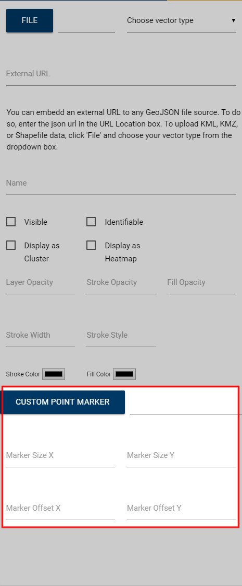

### Upload a Marker
To upload a custom marker, click the "Custom Point Marker" button to open the file picker dialog, and select your marker icon. These must be in a PNG format.

### Marker Size and Offset
Once you've selected your marker file, you can specify the size you wish the icon to render with. Enter a whole number (no decimals) into the textboxes provided for "Marker Size X" and "Marker Size Y". the "X" box determines the pixel width the marker will draw at, and the "Y" box determines the height.

Because custom markers may not draw exactly where the real point is, you can use the "Marker Offset X" and "Marker Offset Y" textboxes to supply an offset to the marker image. Typically these are half of the height and width (again, whole numbers only, no decimals) to ensure the middle of the marker is where the feature is. For example, if your size is 10,15, your offsets would likely be 5,7.

## Editing a Layer Options

Once you've added a new layer, many of the options will be set to defaults, including attribute names and visibility settings. You can change these by editing a layer. To edit a layer, first select it in the active layers list.

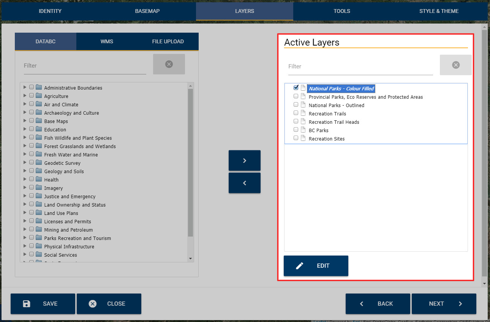

Note: If you have multiple layers selected, the first layer selected in the list will be edited only.

Once you have selected a layer, click the "Edit" button found below the active layers list. This will open the layer edit panel.

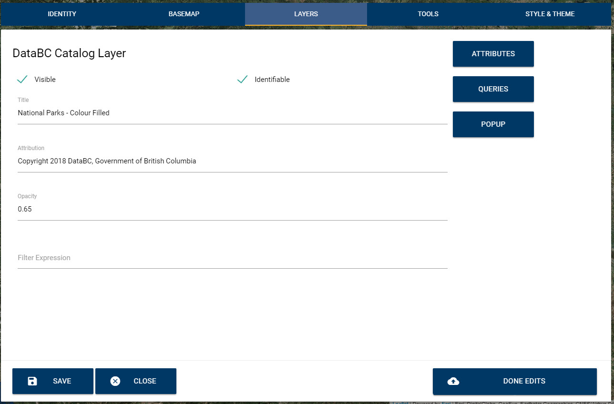

The edit panel will be different depending on the type of layer you're editing. While DataBC Catalog layers and WMS layers share the same editable components, vector layers contain all editable attributes used when uploading them initially.

To review the components for vector layers, please visit the section above describing the upload process.

For DataBC and WMS layers, the options will appear as below:

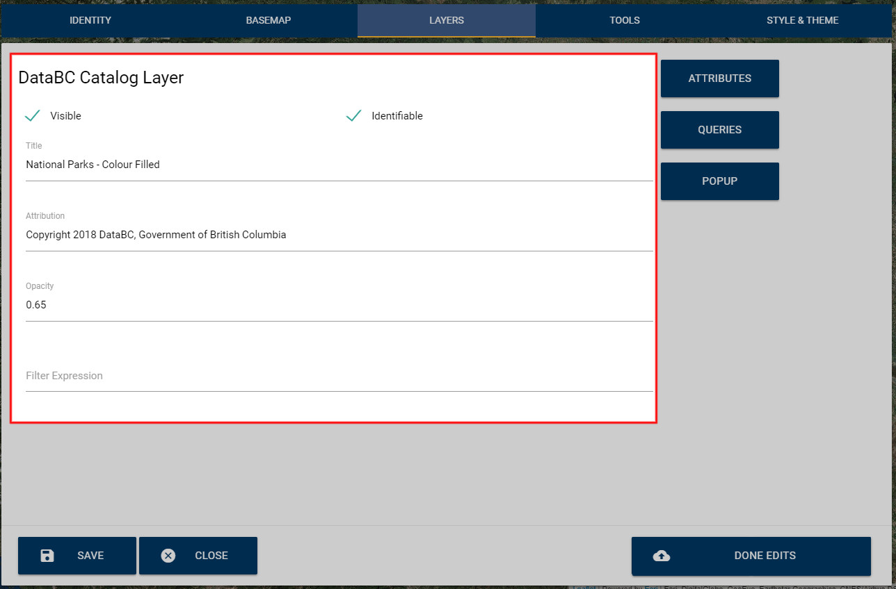

### Visible
the "Visible" checkbox determines if the layer will be shown when your application is started. If it is checked off, the layer will remain hidden until the user turns it on manually.

### Identifiable
The "Identifiable" checkbox determines if the layer accepts interaction with the identify tool. If this is checked, when you click on a feature the identify tool will attempt to return attribute results. If you don't want to identify the feature (for example, if it doesn't have attributes) leave this unchecked.

### Title
The "Title" textbox will contain the display name of the layer. This can contain any string, including special characters.

### Attribution
The "Attribution" textbox allows you to supply additional attribution, which will be displayed on the map overlay.

### Opacity
The "Opacity" textbox accepts decimal values representing the opacity of the whole layer. Acceptable values are 0.0 to 1.0, where 0.0 is totally transparent, and 1.0 is completely visible. Any number higher than 1.0 will be defaulted to 1.0.

### Filter Expression (DataBC Catalog Layers Only)
The "Filter Expression" textbox allows you to provide a SQL syntax definition expression. You can identify the available attributes in the attribute panel (described below). For more information, see [Building a query expression](http://desktop.arcgis.com/en/arcmap/10.3/map/working-with-layers/building-a-query-expression.htm)

### Attributes, Queries, and Popup Configuration

All layers contain options for editing any available attributes, creating and editing queries, or altering the popup that displays when an Identify is executed on the layer.

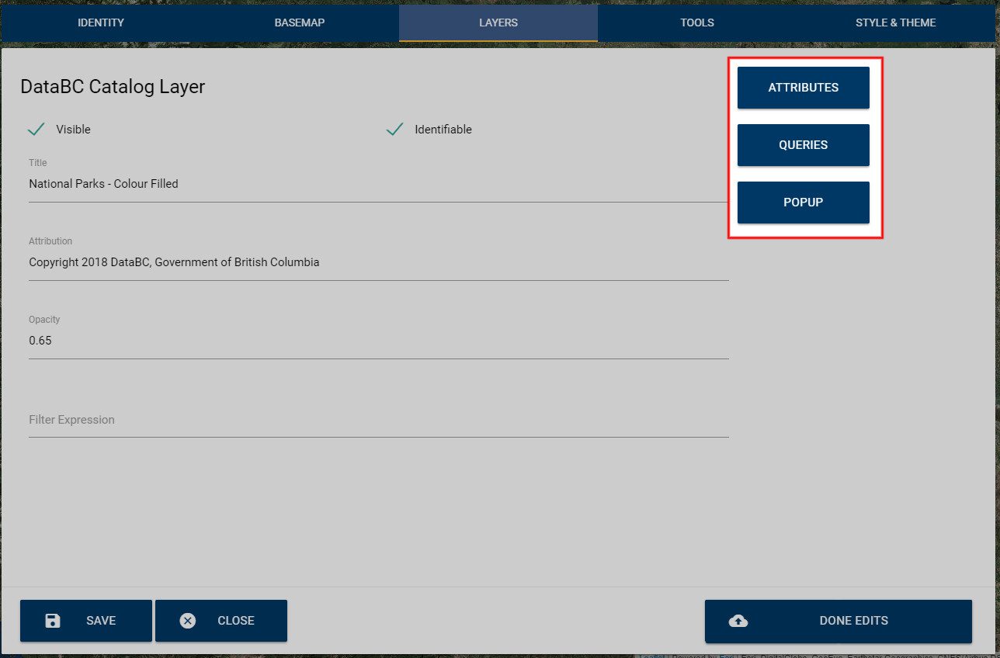

## Attributes

If you click on the "Attributes" button, you will be presented with the attribute edit popup.

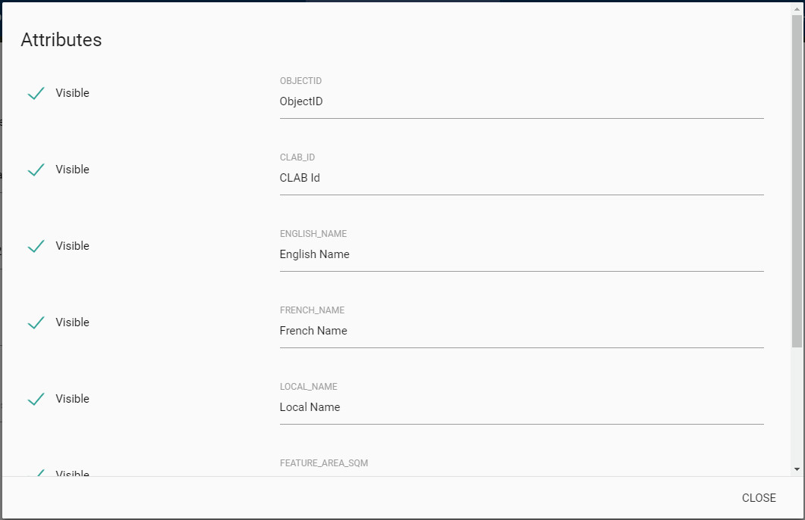

The attribute edit popup does not let you create new attributes. 
You can update attribute visibility by checking or un-checking the "Visibility" check boxes on the left-hand side of the panel.
You can change an attributes title by updating the text in the series of textboxes on the right hand side of the panel. The default attribute name is maintained as the attribute ID and label for filter expressions.

## Queries

All layers and layer types can support queries, as long as the layer contains attributes. If a layer has no attributes, creating a query is impossible. Each layer can contain as many queries as desired. By default, the Admin UI will activate the site dropdown tool and place queries within the dropdown, however it is possible to configure your map configuration manually to move these queries into their own custom buttons on the toolbar.

When you click on the query button from the Edit Layer panel, the Query Editor popup will be displayed.

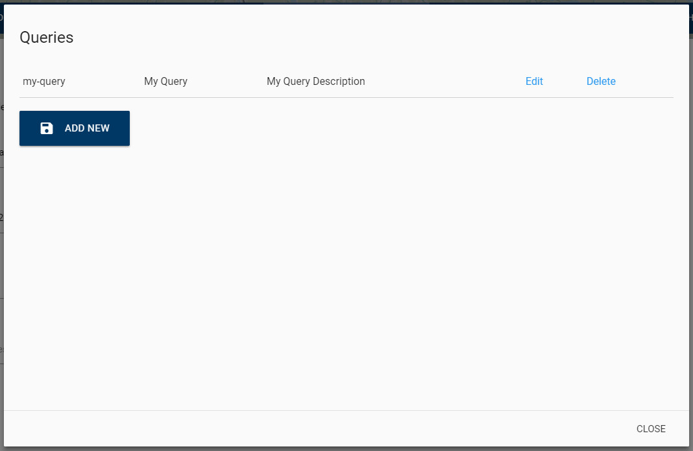

From this popup you can choose to create a new query, edit any existing queries, or delete any existing queries.

Click "edit" or "Create" to begin modifying your query arguments:

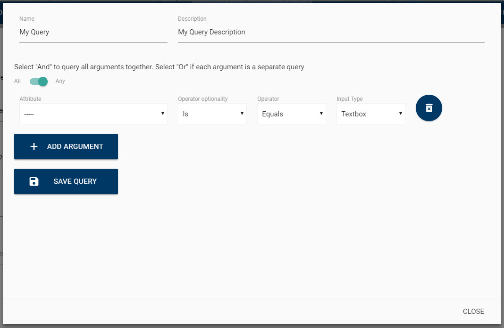

### Name and Description
From this popop, you can edit the queries display name and a description of what your query will do. This description will be displayed to the user in the query menu.

### All / Any Toggle
The All / Any toggle allows you to specify if the query will join the results of each argument together (any), or if all arguments must be met for a result to be found (all).

### Select an Attribute
The Attribute combo box will contain a list of all available attributes for the layer. You can select whatever single attribute you wish to query on.

### Optionality
The optionality combo box contains two values, for "Is" or "Is Not". If you select "Is", the query parameter must contain that value (or a part of it) to return a result. If you select "Is Not", it must not contain the value (or a part of it).

### Operator
The operator combo box allows you to select the special query operator to use for this argument. Options are:
* Equals
* Contains
* Less Than
* Greater Than
* Starts With
* Ends With

Less Than and Greater Than will only function correctly with numeric attributes.

### Input Type
The Input Type combo box contains two values:
* Textbox
* Dropdown

If you select "Textbox", the query panel will display a textbox for the user to enter any desired value. If you select "Dropdown", the query panel will display a dropdown combobox of predefined values. When you select dropdown in the Input Type combobox, an additional button will display:

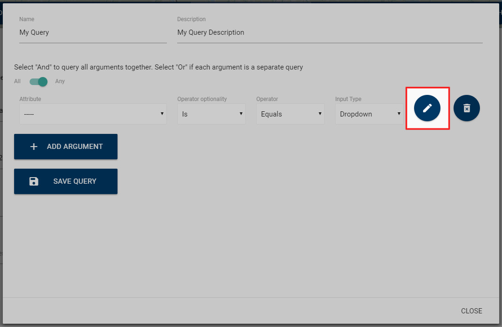

Click this button to open the dropdown selection editor:

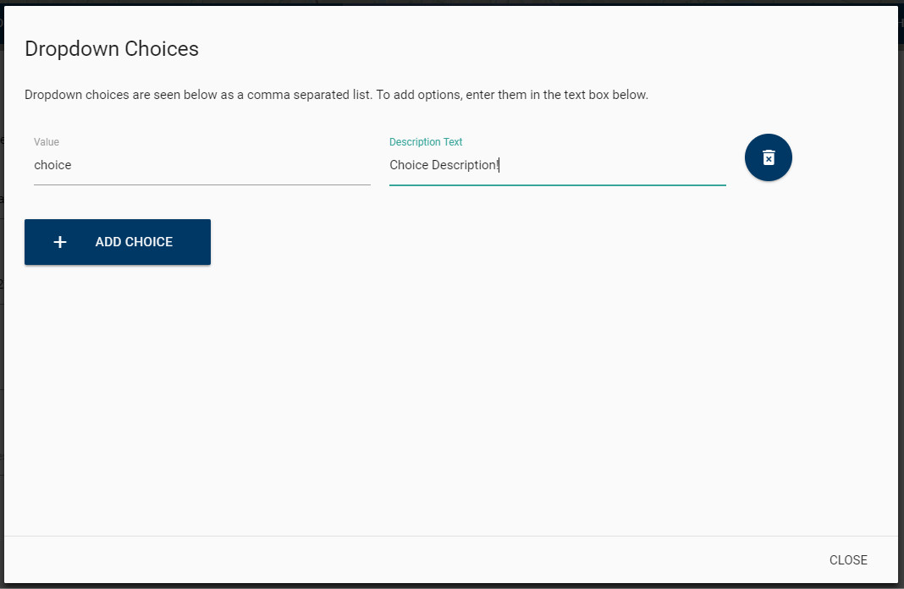

In the dropdown selection editor, you must supply a value in the "Value" text box. This value is used as a key/id, and is not displayed. Because it is an ID value, special characters are not supported.

The "Description Text" textbox allows you to enter a string you want to display to the user. This text can contain special characters.

Click the "Add Choice" button to add additional choices. Click the Trash Can icon next to a choice to remove it. Once you're done adding choices, click "Close" on the bottom right to close the panel.

Note: Currently there is no option to pre-load dropdown choices, but this option is in development and will be implemented in the near future.

### Saving your Query
Once you're done making changes to your query, click the "Save Query" button. Your changes will be saved to the layer. If you wish to cancel your changes, click the "Close" button on the bottom right of the panel.

## Popups

You can add any HTML elements you need to customize your layers popup. You can use [Vue](https://vuejs.org/) syntax to develop highly complicated popup templates. To reference the layer, use double moustaches with the variable "layer" ex: {{ layer.title }} To reference the feature, use double moustaches with the variable "feature" ex: {{ feature.title }} or {{ feature.properties['attribute_name'] }}

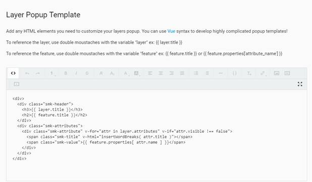

There are 3 templates built into SMK:

- `"@feature-properties"`
Displays all the properties of the feature, using the raw property names.

- `"@feature-attributes"`
Displays the properties of the feature, using the attributes property from the layer.
This will display only the attributes marked `visible`, and uses the `title` of the attribute.

- `"@feature-description"`
Displays the `description` property of the feature as literal HTML.

### Template context

If the template is a Vue template, the props passed to the component will be:

- `layer`
The layer containing the feature

  - `.id`
  The identifier of the layer

  - `.title`
  The title of the layer
  
  - `.attributes`
  [May not be present] The list of attributes configured for this layer.

    - `.id` 
    The identifier of the attribute

    - `.name`
    The name of the feature property (ie, the column name)

    - `.title`
    The title (human readable) defined for the feature property

    - `.visible`
    If the attribute is to be made visible 

- `feature`
The feature to be displayed

  - `.id`
  The identifier of the feature
  
  - `.title`
  The title of the feature

  - `.properties`
  An object containing the properties of the feature. 
  The `key` of an item is the property name.
  The `value` of the item is property's value.