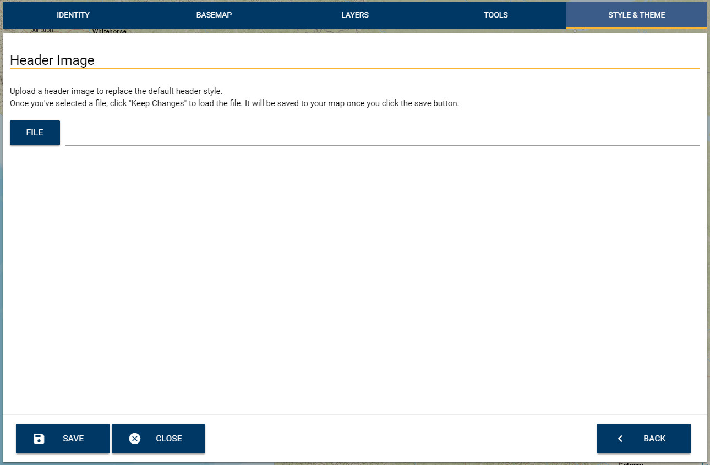

# SMK Admin UI User Guide - Styles & Themes Tab

The Styles and Themes tab is where you'll be able to modify theme and header details for your stand-alone site.

Currently, only Header image uploading is available, but more options are planned.

To upload your header image, click the "File" button. This will open a file selection dialog. Once you've chosen a header image, your header will be uploaded once the document has been saved.