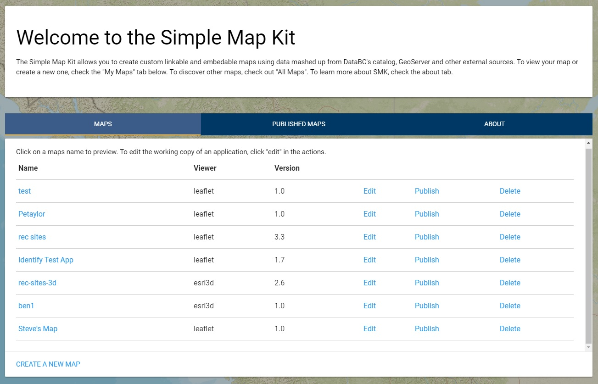
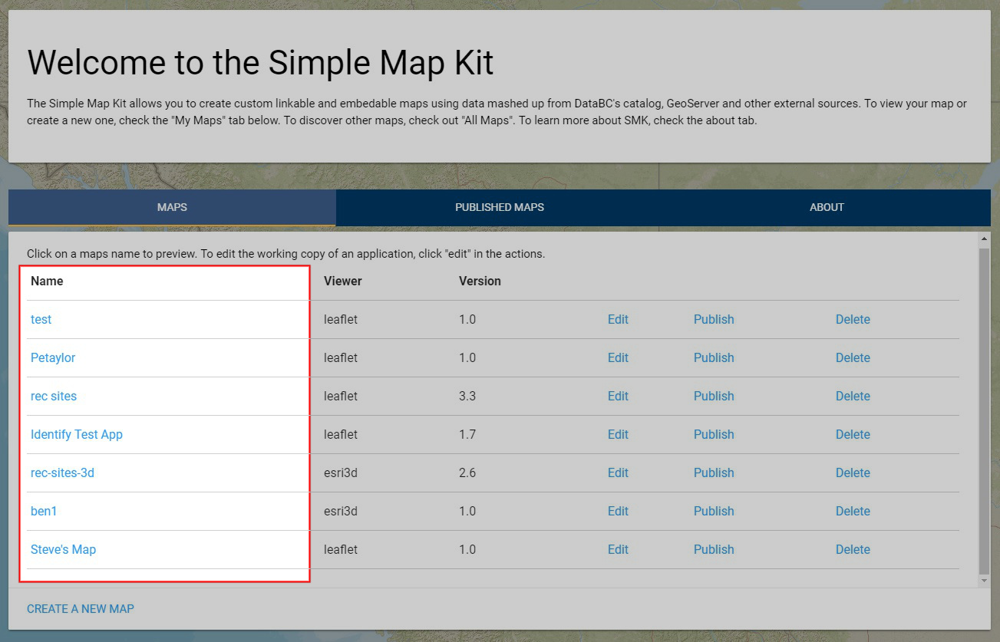
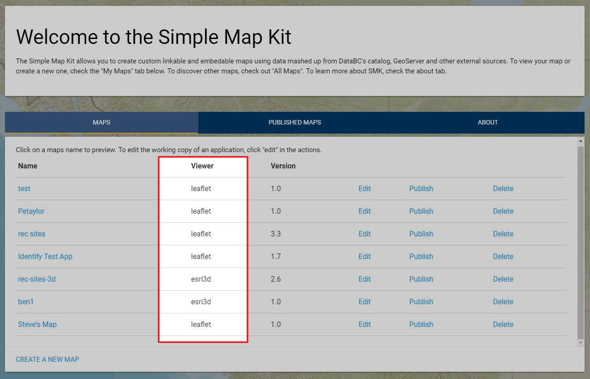
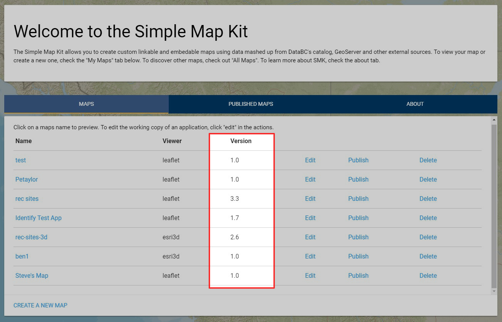
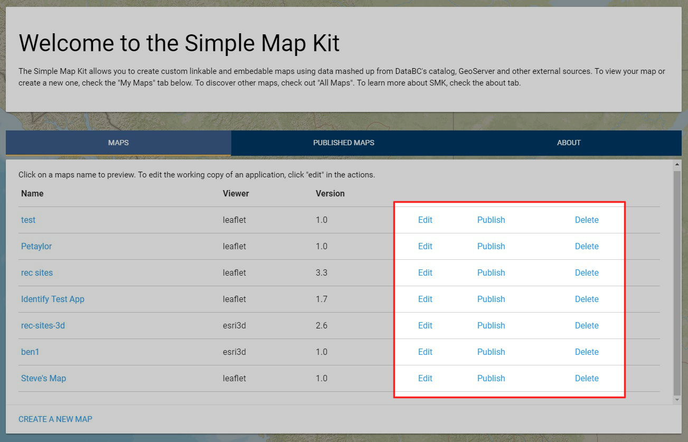
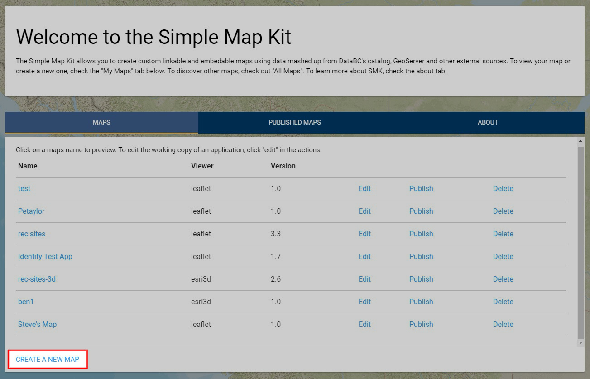

# SMK Admin UI User Guide - Welcome Page
[Back to ToC](SMK-Admin-UI-User-Guide)

When you first log in to the SMK Admin UI, you'll be presented with an application listing:

The Welcome screen contains 5 specific functions: 
* View a stand-alone site
* Identify the viewer used
* Identify the site version
* Perform site actions
* Create a site

## View a Site

To view a created Map Configuration in stand-alone mode, click on the site name to launch in a new tab.

## Identify the Viewer

Next to the name is the type of viewer the site will use. Currently there are 2 supported viewers; Leaflet and ESRI 3D.

## Identify the Version

This column highlights the current version of a sites map configuration. Each site starts at version 1.0. Whenever a modification is made and successfully saved, the minor version will increment (1.1, 1.2, etc.). Every time a site is published, the major version will increase (2.0, 3.0)

## Perform Site Actions

Site actions include Edit, Publish and Delete. 
Clicking Edit will navigate the application to the Map Configuration editor where you can make desired changes to the map configuration.
Clicking Publish will create a published version of the site. Published versions can no longer be edited. You must publish a site before it can be exported.
Clicking Delete will delete the site and all attachments. If the site has a published version, it cannot be deleted until the published version has been deleted.

## Create a Site

To create a new site and map configuration, click the Create link. This will navigate the application to the map configuration editor.